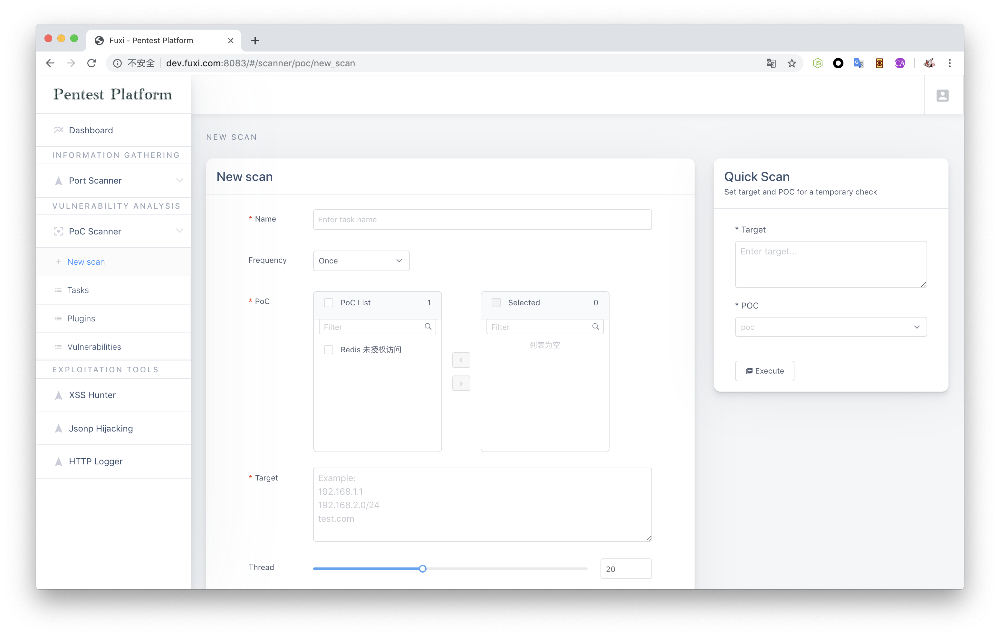

fuxi 2.0 （开发中

切换了主分支 旧代码在 v1.0 分支
有需求 建议欢迎提 issues

# 安装

依赖 Linux python3 redis mongoDB

创建配置文件 instance/config.py `修改_config.py 为 config.py` 并完善配置文件中 redis 及 mongoDB 等配置

```shell script
git clone https://github.com/jeffzh3ng/fuxi.git
cd fuxi
pip install -r requirements.txt
chmod +x fuxi_manage.sh
./fuxi_manage.sh
```

