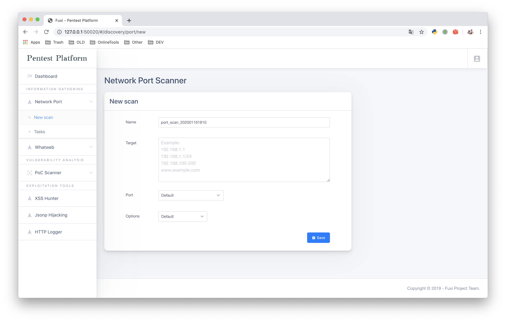

fuxi 2.0 (developing)

## Getting Started

Dependency: `Linux` `python3.x` `redis` `mongoDB`

Get the project:

```shell
git clone https://github.com/jeffzh3ng/fuxi.git
cd fuxi
pip install -r requirements.txt
```

Creating configuration file:

```shell
cd instance/
mv _config.py config.py
vi config.py
```

Begin using `fuxi`

```shell
chmod +x fuxi_manage.sh
./fuxi_manage.sh
```



## Issues

##### &nbsp;&nbsp;Github:&nbsp;&nbsp;&nbsp;[New issue](https://github.com/jeffzh3ng/fuxi/issues/new)
##### &nbsp;&nbsp;E-Mail:&nbsp;&nbsp;&nbsp;<jeffzh3ng@gmail.com>
##### &nbsp;&nbsp;Telegram:&nbsp;&nbsp;&nbsp;<https://t.me/jeffzh3ng>
##### &nbsp;&nbsp;WeChat:&nbsp;&nbsp;&nbsp;[QR Code](docs/img/wechat.jpeg)
*Feel free to contact me if you have any questions or suggestions.*