# Fuxi-Scanner

[](https://www.python.org/)
[](https://github.com/jeffzh3ng/Fuxi-Scanner/blob/master/LICENSE)
[](https://github.com/jeffzh3ng/Fuxi-Scanner/stargazers)

### README [English](../README.md) | 中文

Fuxi-Scanner 是一款开源的网络安全检测工具，适用于中小型企业对企业信息系统进行安全巡航检测

本系统通过模块化提供多种安全功能

- 基于插件的漏洞扫描功能
- 持续化漏洞管理
- 多种协议的弱口令检测
- 企业子域名收集
- 企业 IT 资产管理及服务发现
- 端口扫描
- AWVS(Acunetix Web Vulnerability Scanner) 接口调用

其他功能敬请期待...

## 截图

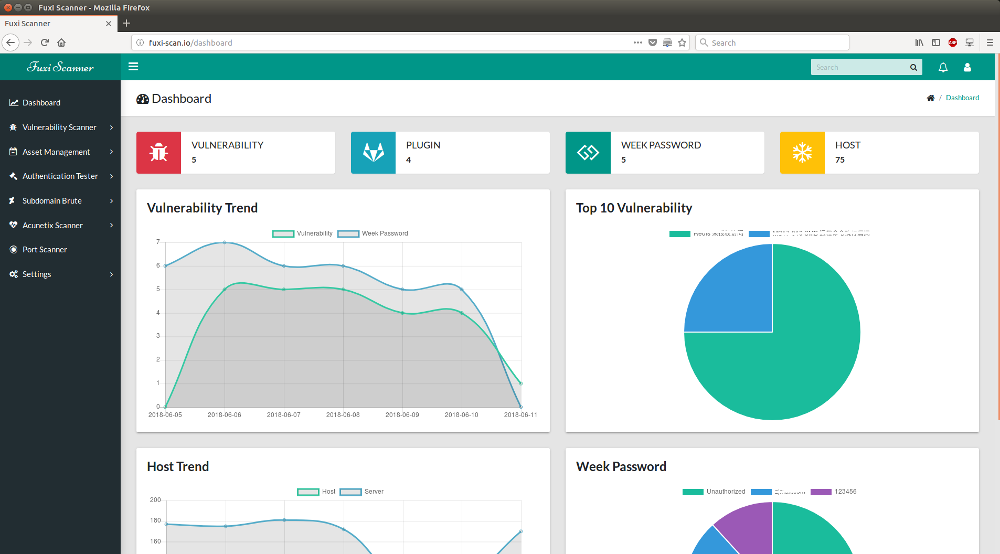

## 快速开始

```bash
git clone --depth 1 https://github.com/jeffzh3ng/Fuxi-Scanner.git fuxi-scanner
cd fuxi-scanner
docker build -t jeffzh3ng/fuxi-scanner .
```

或者

```bash
docker pull jeffzh3ng/fuxi-scanner
```

启动

```bash
docker run -dit -p 5000:5000 -v /opt/data:/data jeffzh3ng/fuxi-scanner:latest
```

或者

```bash
docker run -dit -p 5000:5000 -v /opt/data:/data -v /etc/localtime:/etc/localtime jeffzh3ng/fuxi-scanner
// 同步主机与 Docker 时间
```

等待10s，浏览器打开 `http://127.0.0.1:5000`，检查`fuxi`是否开始工作

`password: whoami`

## 安装

[安装手册](INSTALL.zh.md)

## 使用

### 漏洞扫描功能

该模块主要设计初衷是为了对互联网新爆发的安全漏洞进行快速响应及风险排查，以及对已发现的漏洞修复情况进行追踪，该模块可以和资产服务发现模块结合使用，进行快速应急响应

该模块通过调用知道创宇开源扫描器 Pocsuite 进行扫描，具备编码能力的可以根据模版快速开发插件，不具备插件编写能力的可以通过[SeeBug 社区](https://www.seebug.org/)获取

本项目[tests](tests/pocsuite_plugin)目录下提供部分插件，不定期更新，互联网上有项目提供了很多的 Pocsuite 插件，可以在Github上进行搜索，建议不要执着于插件数量，不要当成漏扫使用哦

扫描任务周期可以选择单次、每日、周及每月，扫描对象可以是单个 IP、网段或者 Url

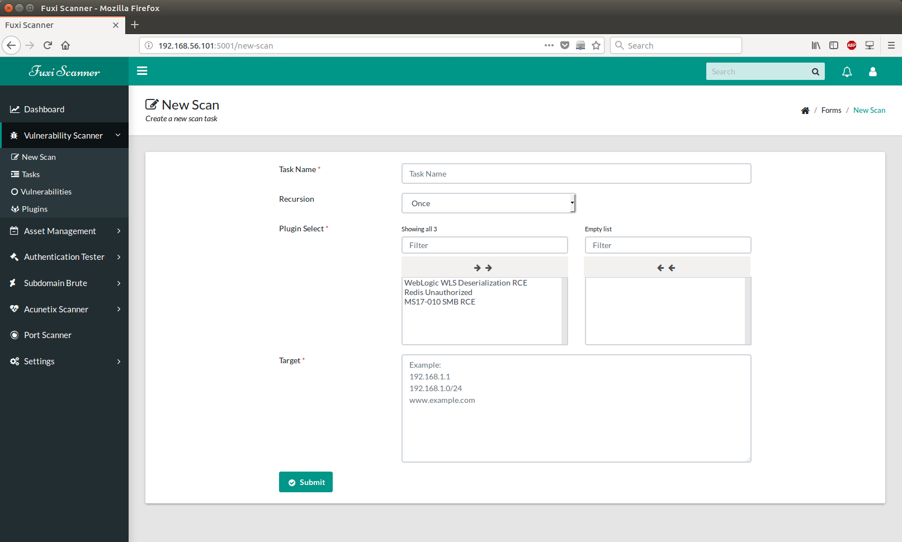

扫描插件通过插件模块中新增插件进行上传，可以同时上传多个插件，插件必须符合 [PoC 编写规范及要求说明](https://github.com/knownsec/Pocsuite/blob/master/docs/CODING.md)

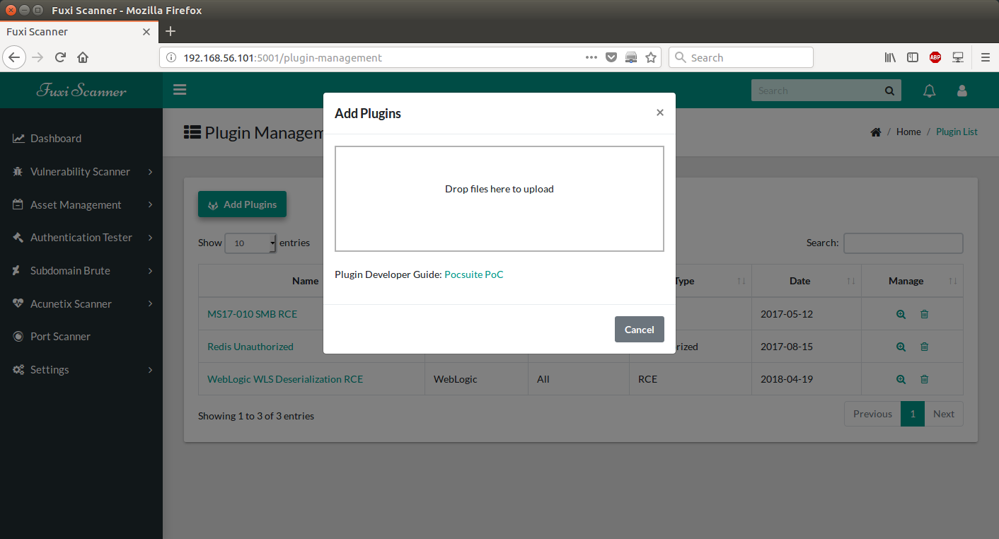

### 资产管理功能

该模块具备资产管理，资产服务发现功能

企业安全人员可以根据信息系统对IT资产进行划分，创建不同的资产库，通过资产库可以灵活的创建扫描漏洞任务

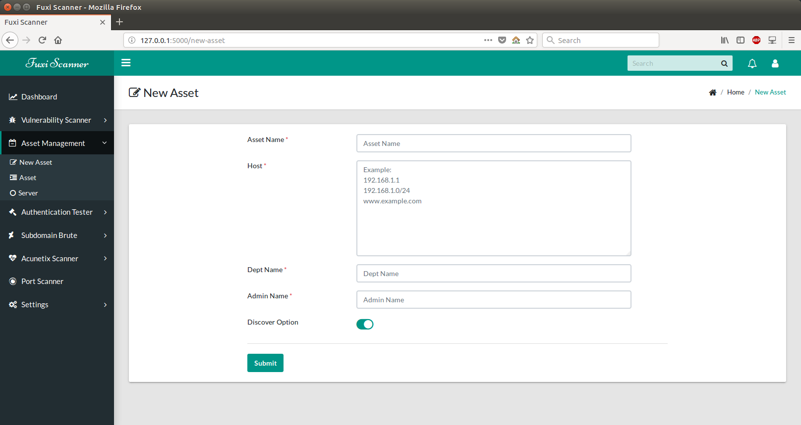

资产服务发现模块通过调用 `Nmap` 对资产库主机进行端口扫描，并将结果入库，企业安全人员可以通过关键字搜索功能筛选出符合条件的服务添加到漏洞扫描任务中

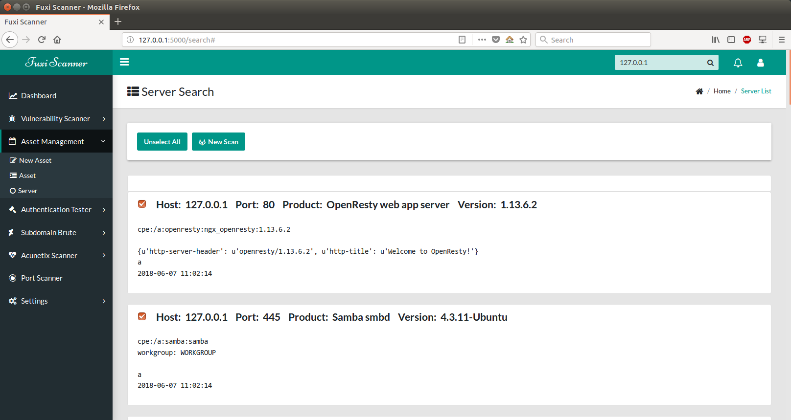

搜索使用右上角搜索框，不要使用服务列表中的筛选功能

### 认证安全检测

后端调用[hydra](https://github.com/vanhauser-thc/thc-hydra)进行扫描，目前支持55种常见协议：

Asterisk, AFP, Cisco AAA, Cisco auth, Cisco enable, CVS, Firebird, FTP, HTTP-FORM-GET, HTTP-FORM-POST, HTTP-GET, HTTP-HEAD, HTTP-POST, HTTP-PROXY, HTTPS-FORM-GET, HTTPS-FORM-POST, HTTPS-GET, HTTPS-HEAD, HTTPS-POST, HTTP-Proxy, ICQ, IMAP, IRC, LDAP, MS-SQL, MYSQL, NCP, NNTP, Oracle Listener, Oracle SID, Oracle, PC-Anywhere, PCNFS, POP3, POSTGRES, RDP, Rexec, Rlogin, Rsh, RTSP, SAP/R3, SIP, SMB, SMTP, SMTP Enum, SNMP v1+v2+v3, SOCKS5, SSH (v1 and v2), SSHKEY, Subversion, Teamspeak (TS2), Telnet, VMware-Auth, VNC and XMPP.

扫描任务周期可以选择单次、每日、周及每月，扫描对象可以是单个 IP、网段或者 Url

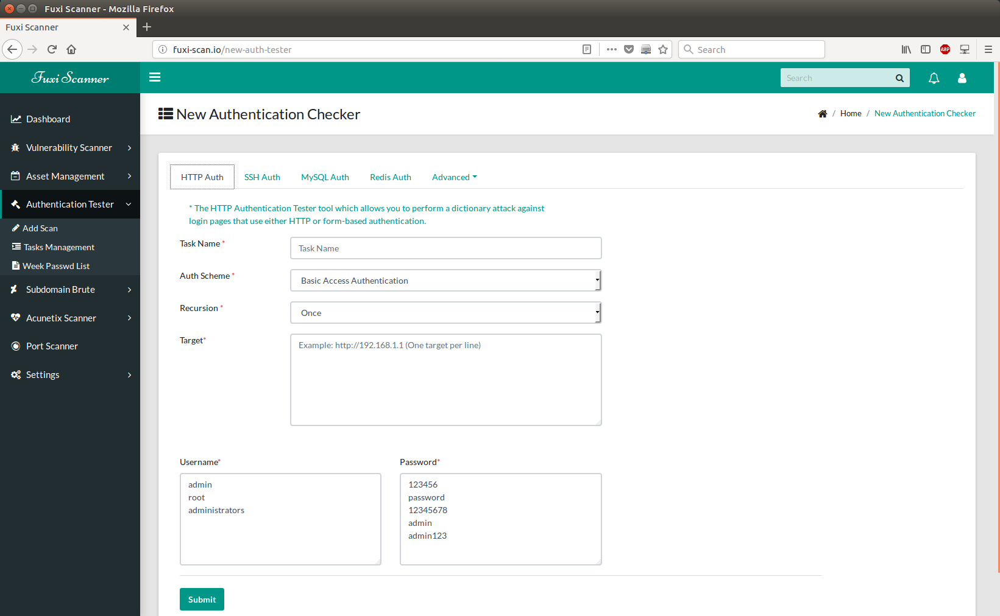

该功能采用模块化方式实现，具备开发能力可以自由添加其他协议破解插件，具体实现会在 [WiKi]() 进行公布

### 子域名收集模块

通过基于字典的暴力猜解方式收集企业子域名，可以在系统高级设置配置字典，项目`tests`文件夹下提供了一份域名字典

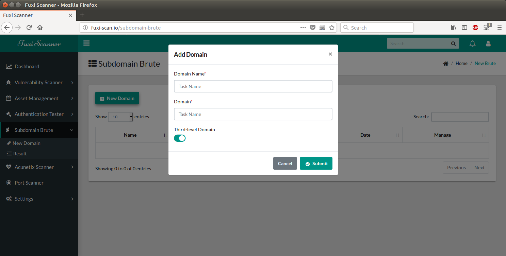

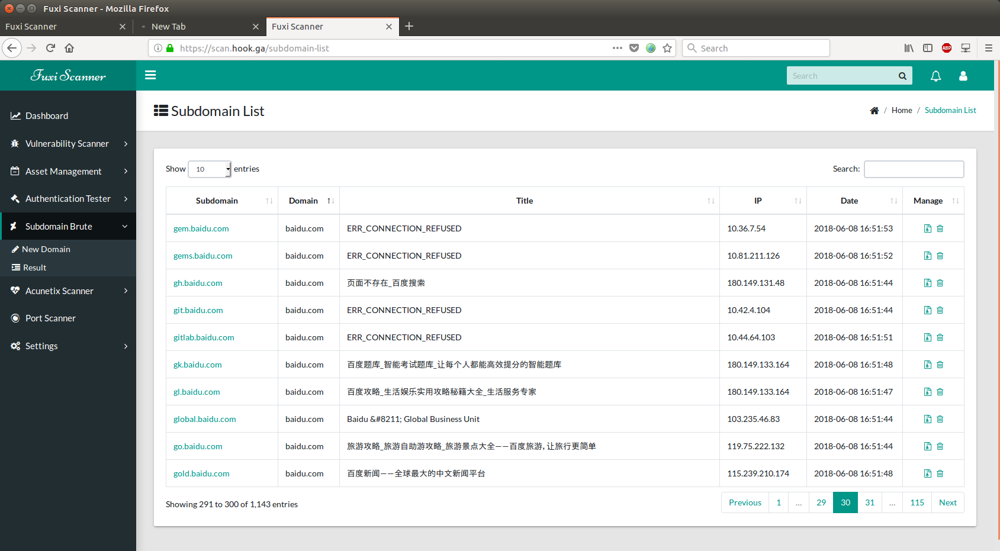

### Acunetix Scanner 接口调用

AWVS 11 不能同时添加多个 URL 地址，该模块通过调用 AWVS 接口进行批量扫描，需在`instance/config.py`配置`AWVS`接口地址及`Key`

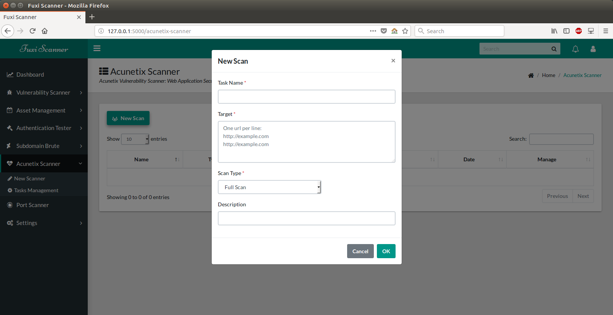

目前支持任务删除，报告批量下载功能

### 端口扫描

一个端口扫描的辅助功能，用于临时的端口探测，存货主机发现，等等

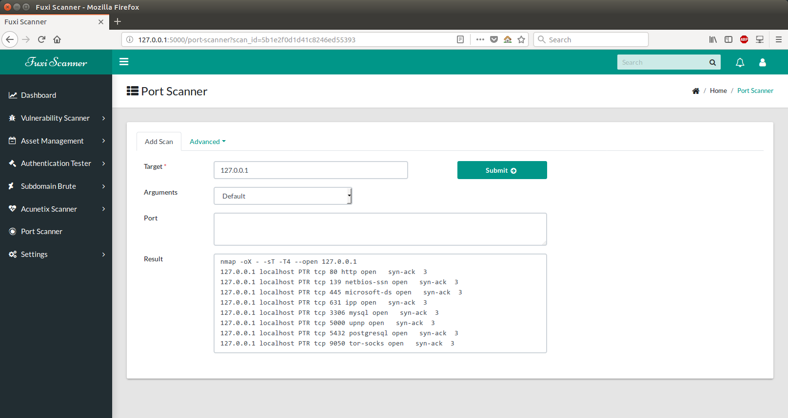

### 系统设置

各模块扫描线程数，子域名字典配置，端口配置

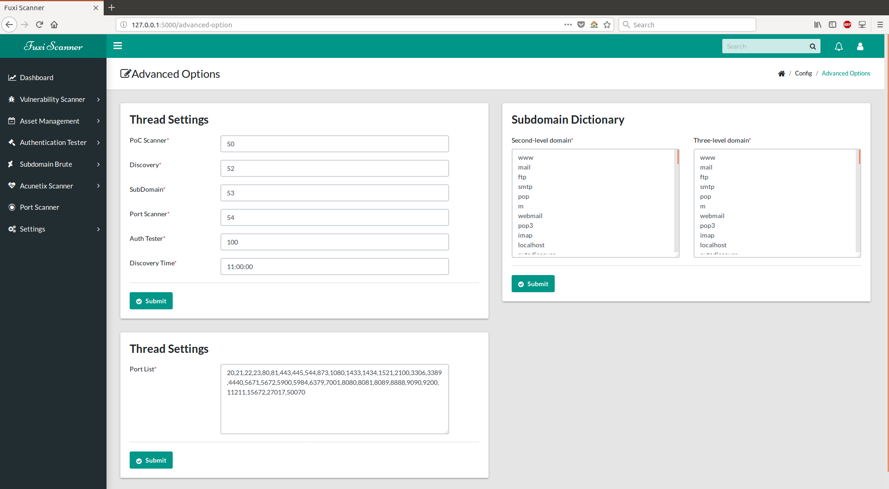

## 相关链接

- 项目主页: [https://fuxi-scanner.com](https://fuxi-scanner.com)
- 下载: [.tar](https://github.com/jeffzh3ng/Fuxi-Scanner/tarball/master) or [.zip](https://github.com/jeffzh3ng/Fuxi-Scanner/zipball/master)
- 邮箱: [jeffzh3ng@gmail.com](mailto:jeffzh3ng@gmail.com)
- Telegram: [jeffzhang](https://t.me/jeffzhang)
- 微信: [jeffzhang](https://fuxi-scanner.com/static/images/wx_20180605112603.jpg)
